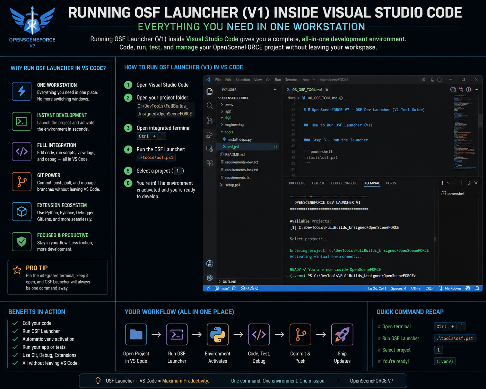

# 📘 OpenSceneFORCE V7 — OSF Dev Launcher (V1 Tool Guide)

---

## 🧱 Overview

The OpenSceneFORCE Dev Launcher (V1), also called **OSF Tool**, is a PowerShell-based project launcher that simplifies development startup.

It allows users to:

- Select a project from a list
- Automatically enter the project directory
- Automatically activate the Python virtual environment (`.venv`)
- Prepare the system for immediate development without manual setup

### 🧠 Simple meaning:

> Instead of typing setup commands every time, you just run OSF and you're instantly inside your development environment.

---

## 🖼️ Visual Overview (VS Code Integration)

This shows how OSF fits into a real development workflow inside VS Code:



### 🧠 What this visual means:

- One workspace (VS Code)
- One terminal (PowerShell)
- One launcher system (OSF)
- Automatic environment activation
- Immediate coding readiness

---

## ⚡ Location of the Tool

The launcher script is stored here:

```text
tools\osf.ps1
```

---

## 🚀 How to Run OSF Launcher (V1)

### Step 1 — Open PowerShell

### Step 2 — Navigate to project root

```powershell
cd "C:\DevTools\FullBuilds_Unsigned\OpenSceneFORCE"
```

### Step 3 — Run the launcher

```powershell
.\tools\osf.ps1
```

---

## 🧠 What Happens When You Run It

When executed, the launcher will:

1. Clear the terminal screen
2. Display available projects
3. Ask user to select a project
4. Navigate to selected project path
5. Check for `.venv` environment
6. Automatically activate `.venv` if it exists
7. Confirm ready state for development

---

## ⚙️ Core Script (Reference)

```powershell
# =========================
# OpenSceneFORCE Dev Launcher V1
# =========================

Clear-Host

$projects = @{
    "1" = "C:\DevTools\FullBuilds_Unsigned\OpenSceneFORCE"
}

Write-Host "====================================="
Write-Host "   OPENSCENEFORCE DEV LAUNCHER V1"
Write-Host "====================================="
Write-Host ""

Write-Host "Available Projects:"
foreach ($key in $projects.Keys) {
    Write-Host "[ $key ] $($projects[$key])"
}

Write-Host ""
$choice = Read-Host "Select project"

if (-not $projects.ContainsKey($choice)) {
    Write-Host "Invalid selection. Exiting..." -ForegroundColor Red
    exit
}

$path = $projects[$choice]

if (!(Test-Path $path)) {
    Write-Host "Project path not found!" -ForegroundColor Red
    exit
}

Set-Location $path

Write-Host ""
Write-Host "Entering project: $path" -ForegroundColor Green

if (Test-Path ".venv\Scripts\Activate.ps1") {
    Write-Host "Activating virtual environment..." -ForegroundColor Cyan
    .\.venv\Scripts\Activate.ps1
} else {
    Write-Host "No virtual environment found." -ForegroundColor Yellow
}

Write-Host ""
Write-Host "READY ✔ You are now inside OpenSceneFORCE" -ForegroundColor Green
```

---

## 🧠 Design Purpose

This tool was created to:

- Reduce manual setup steps
- Speed up developer onboarding
- Standardize environment activation
- Provide a foundation for multi-project management

---

## 🔥 Current Version

```text
V1 — Single Project Launcher
```

---

## 🚀 Future Planned Versions

### V2 — Multi-project system
- Multiple selectable projects
- Dynamic project registry

### V3 — Command shortcut system
- `osf` command execution
- Global terminal integration

### V4 — Full Dev Dashboard UI
- Visual project selector
- Status indicators
- Git integration
- Environment health checks

---

## 📘 Related Documentation

- [Onboarding Flow](docs/07_OSF_ONBOARDING.md)

---

## 🧠 Summary

The OSF Tool V1 is the foundation of a development operating layer for OpenSceneFORCE.

It converts manual environment setup into a **single-command workflow system**.
