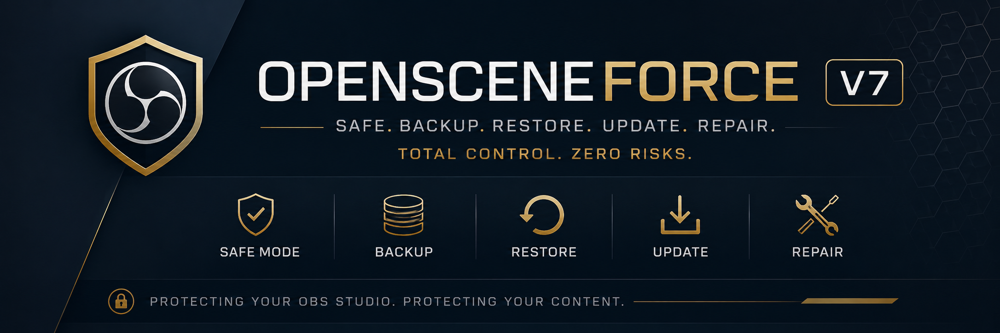
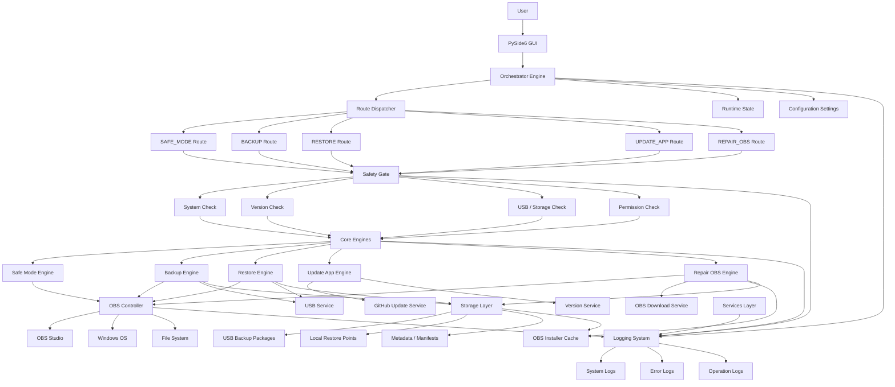
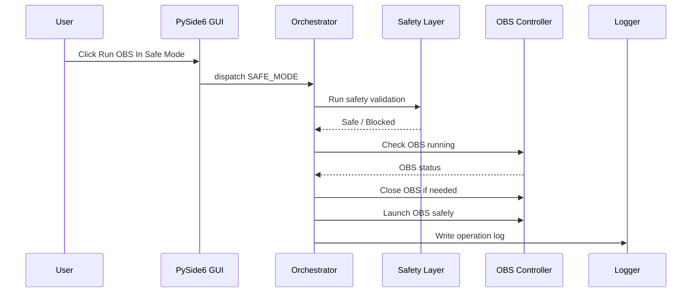

# OpenSceneFORCE V7 — Architecture as Code

> **Status:** V7 Foundation Scaffold Locked  
> **Architecture Style:** Modular, routed, safety-gated, AWS-style internal tool design  
> **Primary Runtime:** Python 3.11+  
> **GUI Framework:** PySide6  
> **Target Platform:** Windows 10 / Windows 11  

---

## 1. Purpose

OpenSceneFORCE V7 is a modular desktop application designed to safely manage the OBS Studio lifecycle.

The application is built to support:

- Run OBS In Safe Mode
- Create OBS backups
- Restore OBS configurations
- Update the OpenSceneFORCE app
- Repair OBS by reinstalling OBS when needed
- Maintain restore points
- Protect users from unsafe operations

The goal is to move away from fragile script-based workflows and into a structured, routed application where every operation passes through a controlled execution pipeline.

---

## 2. Engineering Philosophy

OpenSceneFORCE is not a loose collection of scripts.

It is a state-driven software platform that manages OBS through controlled execution, validation, recovery, logging, and user-safe workflows.

The engineering rule is:

> Architecture drives implementation — not the other way around.

Any major code change should fit into the architecture below before it is implemented.

---

## 3. High-Level System Model

```text
USER
  ↓
PySide6 GUI
  ↓
Orchestrator Router
  ↓
Safety Gate
  ↓
Route Handler
  ↓
Core Engine
  ↓
Services / System Layer
  ↓
OBS Studio + File System
  ↓
State + Logs + Storage
```

The GUI does not directly call backup, restore, update, repair, or OBS system functions.

All actions are routed through the orchestrator.

---

## 4. Current Repository Structure

```text
OpenSceneFORCE/
│
├── README.md
├── requirements.txt
│
├── app/
│   │   main.py
│   │
│   ├── config/
│   │       settings.py
│   │
│   ├── core/
│   │       backup_engine.py
│   │       repair_engine.py
│   │       restore_engine.py
│   │       update_engine.py
│   │
│   ├── orchestrator/
│   │       engine.py
│   │
│   ├── routes/
│   │
│   ├── safety/
│   │       system_check.py
│   │
│   ├── services/
│   │       github_update_service.py
│   │       obs_download_service.py
│   │       usb_service.py
│   │       version_service.py
│   │
│   ├── state/
│   │       state.py
│   │
│   ├── system/
│   │       obs_controller.py
│   │
│   ├── ui/
│   │       main_window.py
│   │
│   └── utils/
│           logger.py
│
├── docs/
│       01_VISION.md
│       02_SAFETY.md
│       03_FLOWS.md
│
├── engineering/
│   │   architecture.md
│   │   coding_standards.md
│   │   execution_pipeline.md
│   │   state_machine.md
│   │
│   ├── assets/
│   │   ├── banners/
│   │   ├── diagrams/
│   │   ├── icons/
│   │   └── ui/
│   │
│   └── diagrams/
│           architecture.mmd
│           execution_flow.mmd
│           state_machine.mmd
│
└── tools/
        install_deps.py
```

---

## 5. Layer Responsibilities

| Layer | Folder | Responsibility |
|------|--------|----------------|
| UI Layer | `app/ui/` | User interaction, buttons, status display |
| Orchestrator Layer | `app/orchestrator/` | Central route dispatcher and execution controller |
| Routes Layer | `app/routes/` | Future workflow route modules |
| Core Engine Layer | `app/core/` | Business logic for backup, restore, update, repair |
| Safety Layer | `app/safety/` | Blocks unsafe execution before engines run |
| Services Layer | `app/services/` | External integrations such as USB, downloads, version checks |
| System Layer | `app/system/` | OBS process control and operating system interaction |
| State Layer | `app/state/` | Runtime state tracking |
| Config Layer | `app/config/` | Application settings and behavior flags |
| Utils Layer | `app/utils/` | Shared helpers and logging |
| Engineering Docs | `engineering/` | Architecture, diagrams, standards, implementation references |

---

## 6. Spider-Map System Architecture

This diagram shows the full system relationship model.



---

## 7. Route Model

The orchestrator owns the route map.

User actions should resolve into one of these routes:

| Route | User Action | Engine |
|------|-------------|--------|
| `SAFE_MODE` | Run OBS In Safe Mode | Safe Mode Engine |
| `BACKUP` | Create Backup | Backup Engine |
| `RESTORE` | Restore OBS | Restore Engine |
| `UPDATE_APP` | Update App | Update Engine |
| `REPAIR_OBS` | Repair OBS | Repair Engine |

The GUI should only dispatch route names.

Example:

```text
GUI button click
  ↓
dispatch("BACKUP")
  ↓
orchestrator validates
  ↓
safety gate runs
  ↓
backup engine executes
```

---

## 8. Execution Pipeline

Every operation follows this pipeline:

```text
1. User clicks button
2. GUI sends route to Orchestrator
3. Orchestrator validates route
4. Safety Layer checks environment
5. OBS state is checked
6. Restore point is created when needed
7. Core Engine executes action
8. Services/System layer performs external work
9. Logs are written
10. State is updated
```

No operation should bypass this pipeline.

---

## 9. Safe Mode Flow



Safe Mode means:

- Validate environment
- Check OBS status
- Close OBS if needed
- Launch OBS under controlled workflow
- Monitor and log result

---

## 10. Backup Flow

```text
User → GUI → Orchestrator → Safety Gate → Backup Engine → USB Service → Storage → Logs
```

Backup rules:

- OBS must be closed before backup.
- Backup should prefer USB or external drive.
- Backups must not overwrite existing backups.
- Backup metadata should be written to a manifest.
- Logs must be created for every backup run.

---

## 11. Restore Flow

```text
User → GUI → Orchestrator → Safety Gate → Restore Engine → Restore Point → OBS Config Apply → Logs
```

Restore rules:

- Create restore point before modifying OBS.
- Validate backup package before restore.
- Never restore while OBS is running.
- Rollback should be possible if restore fails.
- All restore actions must be logged.

---

## 12. Update App Flow

Update App means updating OpenSceneFORCE itself, not OBS.

```text
User → GUI → Orchestrator → Safety Gate → Update Engine → GitHub Update Service → Version Service → Logs
```

Update rules:

- Check current app version.
- Check available app version.
- Warn user if update is recommended.
- Do not overwrite app files until download is complete.
- Verify update before replacing old version.

---

## 13. Repair OBS Flow

Repair OBS means reinstalling or repairing OBS when the current OBS install is broken.

```text
User → GUI → Orchestrator → Safety Gate → Repair Engine → OBS Cache / Installer → OBS Repair → Logs
```

Repair rules:

- OBS must be closed.
- Create restore point first.
- Use cached installer when available.
- Download replacement installer only through controlled services.
- Preserve OBS data when possible.
- Log all repair operations.

---

## 14. Safety Rules

These rules are non-negotiable:

1. GUI never performs business logic directly.
2. All user actions must go through the Orchestrator.
3. All routes must pass the Safety Layer.
4. OBS must be closed before backup, restore, update, or repair.
5. Restore points must be created before destructive operations.
6. Backups must prefer USB or external storage.
7. No overwrite without validation.
8. Logs must never overwrite previous logs.
9. Unsafe states stop the operation.
10. If validation fails, the operation is blocked.

---

## 15. Logging Rules

Logging is required across all layers.

Log types:

- System logs
- Error logs
- Operation logs
- Debug logs

Log naming should be timestamped.

Example:

```text
logs/
├── system/
│   └── system_2026-06-25_081500.txt
├── error/
│   └── error_2026-06-25_081500.txt
└── operation/
    └── backup_2026-06-25_081500.txt
```

---

## 16. Engineering Assets

Architecture images, banners, UI mockups, and rendered diagrams belong in:

```text
engineering/assets/
├── banners/
├── diagrams/
├── icons/
└── ui/
```

Editable Mermaid source files belong in:

```text
engineering/diagrams/
├── architecture.mmd
├── execution_flow.mmd
└── state_machine.mmd
```

Recommended banner path:

```text
engineering/assets/banners/opensceneforce_v7_architecture_banner.png
```

Markdown reference:

```md

```

---

## 17. Team Responsibility Map

| Area | Responsibility |
|------|----------------|
| Frontend / UI | PySide6 layout, buttons, user messages |
| Backend / Core | Engines, routes, orchestration logic |
| Safety / Security | Validation, hashes, restore protection |
| System Integration | OBS process control, Windows interaction |
| DevOps / Release | Update App, packaging, dependency installer |
| Documentation | Architecture, diagrams, workflows |

---

## 18. Future Expansion Rules

New features must enter through one of the existing layers.

Do not create new top-level folders unless:

1. The architecture document is updated first.
2. The feature does not belong in an existing layer.
3. The new folder has a clearly defined responsibility.

Preferred expansion pattern:

```text
GUI Action
  ↓
Orchestrator Route
  ↓
Safety Validation
  ↓
Core Engine
  ↓
Service/System Module
  ↓
Logs + State
```

---

## 19. Final Engineering Statement

OpenSceneFORCE V7 is a routed, safety-gated OBS lifecycle platform.

It is designed to be:

- predictable
- modular
- recoverable
- professional
- portable
- safe by default

The scaffold is now locked.

Future work should focus on implementation, not restructuring.

**Architecture drives implementation — not the other way around.**
